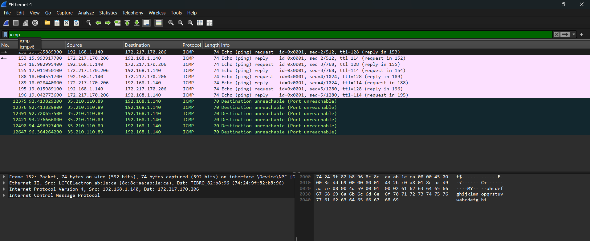
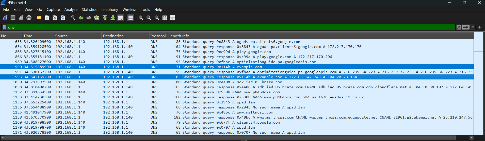
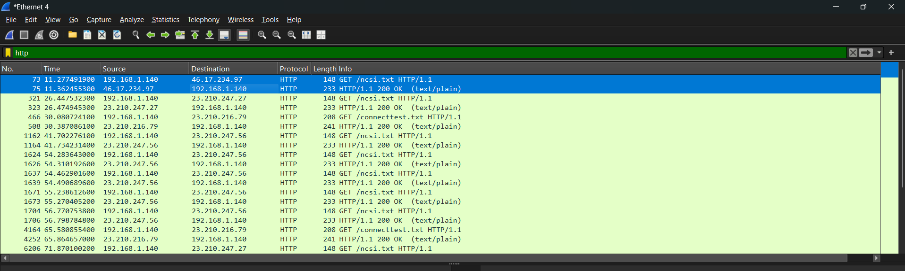
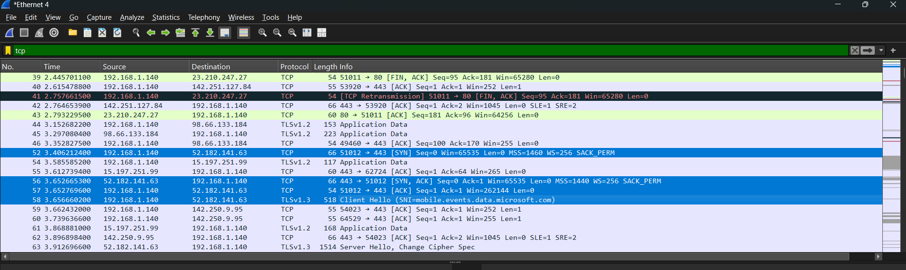
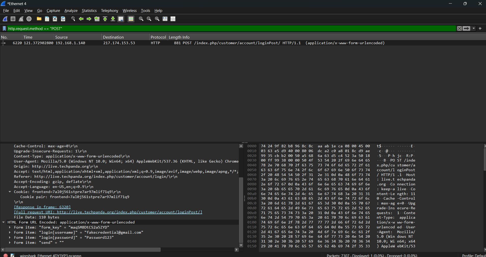

# Network-Analysis-Lab
A hands-on cybersecurity lab focused on network traffic analysis, packet inspection, and protocol analysis using Wireshark to identify network anomalies, security vulnerabilities, IoCs, and baseline network behavior.

## 🌐 Standard Network Traffic Analysis & Protocol Baseline

To establish a baseline for normal network behaviors and understand standard protocol mechanics, a series of controlled network interactions were analyzed using Wireshark display filters. Below is a breakdown of core foundational protocols and diagnostic procedures.

---

### 1. ICMP (Internet Control Message Protocol)
* **Objective:** Verify network layer connectivity and latency to an external host (`google.com`).
* **Analysis & Mechanics:** Using the `icmp` filter isolates the basic Echo Request (Type 8) sent by the local host and the corresponding Echo Reply (Type 0) returned by the target server. This test validates functional outbound routing and basic Layer 3 end-to-end reachability.
* **Filter Used:** `icmp`

---

### 2. DNS (Domain Name System)
* **Objective:** Observe application-layer name resolution converting a human-readable domain into an IP address.
* **Analysis & Mechanics:** Filtering for `dns` captures the initial UDP standard query (A record request) for `example.com` sent to port 53, followed immediately by the DNS server's response packet containing the authoritative IPv4 mapping.
* **Filter Used:** `dns`

---

### 3. HTTP Request & Response (Hypertext Transfer Protocol)
* **Objective:** Inspect cleartext web traffic delivery and status communication.
* **Analysis & Mechanics:** Applying the `http` filter isolates the standard client-side browser `GET` request pulling a web resource and pairs it with the web server's corresponding `200 OK` transaction response payload. This confirms successful application layer delivery over TCP.
* **Filter Used:** `http`

---

### 4. TLS Handshake (Transport Layer Security)
* **Objective:** Analyze the initial security negotiation sequence establishing encrypted web communications.
* **Analysis & Mechanics:** Utilizing the `tls` filter reveals the foundational cryptographical handshake mechanics:
  * **Client Hello:** The source machine transmits an unencrypted packet announcing its maximum supported TLS version along with a comprehensive list of supported cryptographic options (**Cipher Suites**).
  * **Server Hello:** The destination server responds, actively evaluating the client's capabilities and selecting the specific **Cipher Method** and algorithm suite that will govern the session's encryption.
* **Filter Used:** `tls`

---

### 5. Cleartext Credential Interception (Unsecured POST Data)
* **Objective:** Demonstrate the severe security risks associated with submitting sensitive authentication vectors over unencrypted protocols.
* **Analysis & Mechanics:** Isolating web submissions using the `http.request.method == "POST"` display filter exposes application data fields sent inline to a web server. Because the connection lacks TLS/SSL wrappers, highly sensitive variables—such as plain text usernames, login passwords, or form values—can be viewed in the cleartext packet byte stream by anyone monitoring the wire.
* **Filter Used:** `http.request.method == "POST"`

## 🔍 Compromised Host Identification & Artifact Analysis

To establish the scope of the incident and properly identify the target profile, a deep-dive analysis of the network infrastructure layers was conducted within the packet capture. Below is the verified identity and hardware profile of the affected asset.

### 📋 Executive Summary Table

| Artifact Category | Identified Value | Evidence Source |
| :--- | :--- | :--- |
| **Internal IP Address** | `10.2.28.101` | IPv4 Layer Header |
| **Hardware MAC Address** | `00:19:d1:b2:4d:ad` | Ethernet II Layer Header (Intel) |
| **Host Machine Name** | `DESKTOP-TEYQ2NR` | DHCP / NetBIOS Name Service |
| **Account Username** | `brolf` | Kerberos Client Name String (`CNameString`) |
| **User Full Name** | **Becka Rolf** | Raw Packet String Search / Active Directory Query |

---

### 🖼️ Evidence & Forensic Artifacts

#### 1. Initial Compromise & Analysis (Identifying compromised system & activity)
The infected device was identified using an IP address filter to show which system was interacting with the known malicious IP (`45.131.214.85`). 

Following host compromise, traffic analysis revealed HTTP-based Command and Control (C2) activity over port 443. The infected host regularly "checked in" with the attacker's server, executing decrypted commands via a background RAT and returning encrypted data using HTTP POST requests.

#### 2. Network Layer Profile (IP & MAC Address)
By isolating the perimeter breach and analyzing the outbound connection requests to the malicious Command and Control (C2) infrastructure IP (`45.131.214.85`), the internal victim machine's Layer 2 and Layer 3 configurations were extracted. 
* **Source MAC:** `00:19:d1:b2:4d:ad` (Intel network interface card)
* **Source IP:** `10.2.28.101`

#### 3. Host Machine Identification
The device identity was cross-referenced and confirmed via network broadcast protocols. The operating system actively mapped the network configuration back to the specific workstation deployment name.
* **Hostname:** `DESKTOP-TEYQ2NR`

#### 4. Domain Account Username
Analyzing the Kerberos ticket requests (`AS-REQ`) directed toward the local Domain Controller (`easyas123-dc.easyas123.tech`) exposed the unique Security Account Manager (SAM) login ID used during the session.
* **Username String:** `brolf`

#### 5. Victim Identity Verification (Full Name)
A deep-packet string search extracted the full legal identity linked directly to the `brolf` account profile within the Active Directory schema database traffic, ensuring absolute validation of the target identity.
* **Victim Full Name:** Becka Rolf

