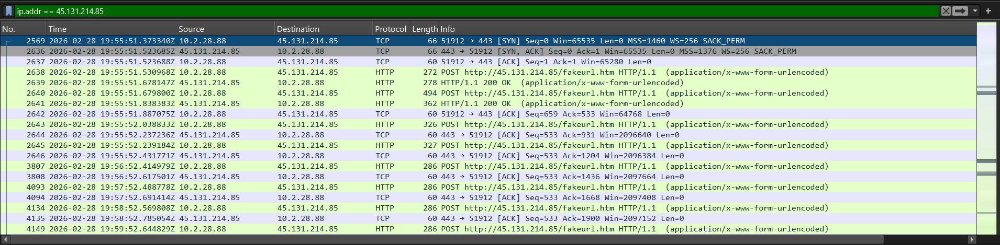
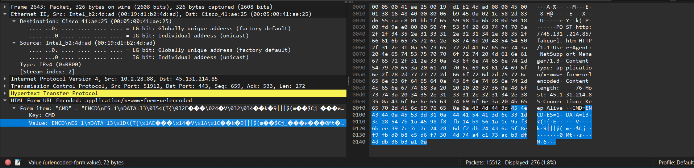
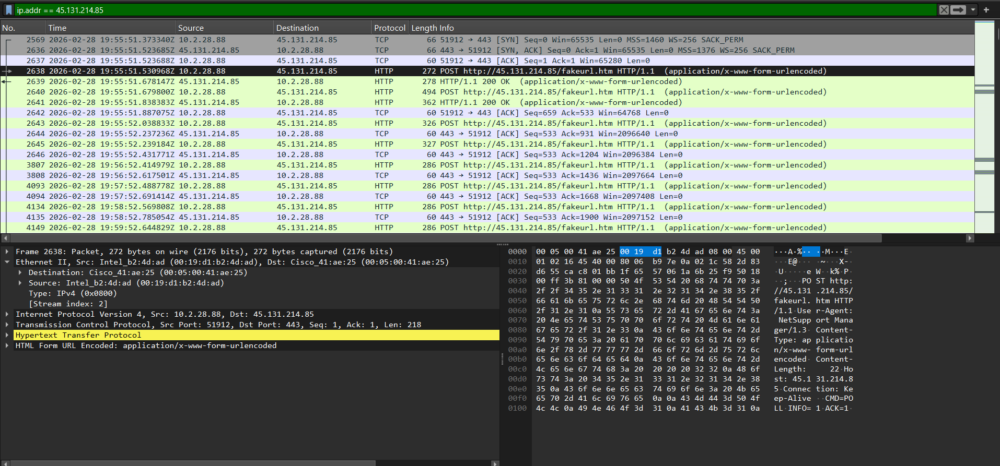
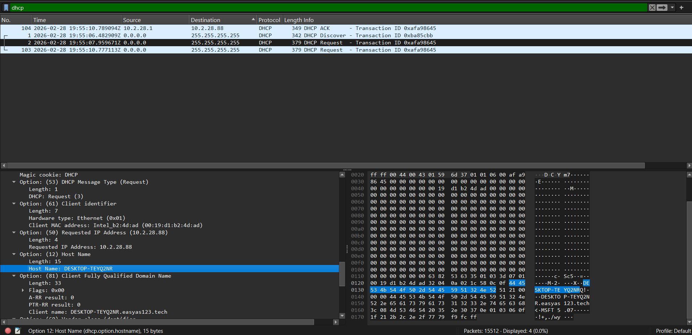
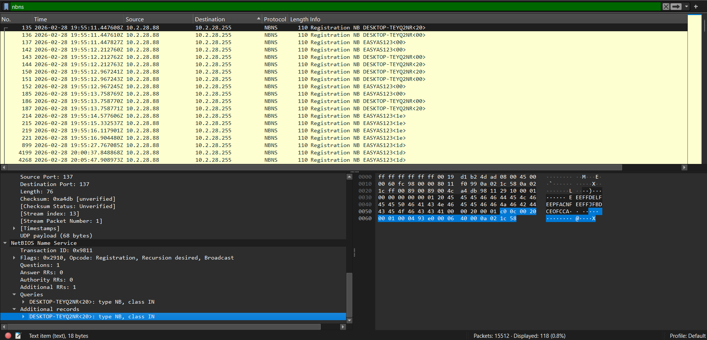
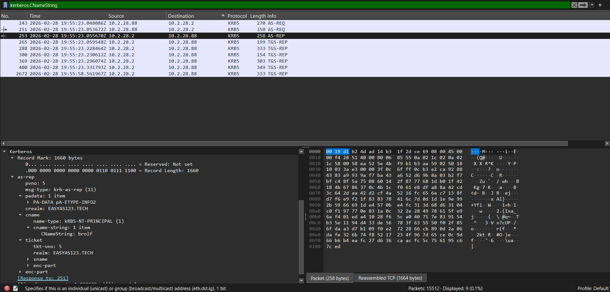
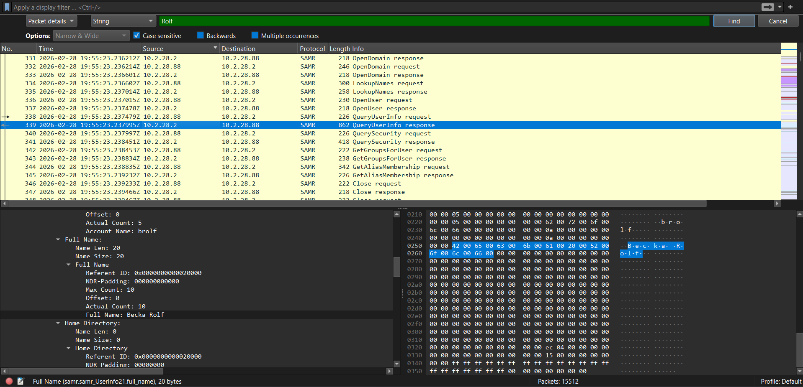

# Network-Analysis-Lab
A hands-on cybersecurity lab focused on network traffic analysis, packet inspection, and protocol analysis using Wireshark to identify network anomalies, security vulnerabilities, IoCs, and baseline network behavior.

## 🔍 Compromised Host Identification & Artifact Analysis

To establish the scope of the incident and properly identify the target profile, a deep-dive analysis of the network infrastructure layers was conducted within the packet capture. Below is the verified identity and hardware profile of the affected asset.

### 📋 Executive Summary Table

| Artifact Category | Identified Value | Evidence Source |
| :--- | :--- | :--- |
| **Internal IP Address** | `10.2.28.101` | IPv4 Layer Header |
| **Hardware MAC Address** | `00:19:d1:b2:4d:ad` | Ethernet II Layer Header (Intel) |
| **Host Machine Name** | `DESKTOP-TEYQ2NR` | DHCP / NetBIOS Name Service |
| **Account Username** | `brolf` | Kerberos Client Name String (`CNameString`) |
| **User Full Name** | **Becka Rolf** | Raw Packet String Search / Active Directory Query |

---

### 🖼️ Evidence & Forensic Artifacts

#### 1. Initial Compromise & Analysis (Identifying compromised system & activity)
The infected device was identified using an IP address filter to show which system was interacting with the known malicious IP (`45.131.214.85`). 

Following host compromise, traffic analysis revealed HTTP-based Command and Control (C2) activity over port 443. The infected host regularly "checked in" with the attacker's server, executing decrypted commands via a background RAT and returning encrypted data using HTTP POST requests.

#### 2. Network Layer Profile (IP & MAC Address)
By isolating the perimeter breach and analyzing the outbound connection requests to the malicious Command and Control (C2) infrastructure IP (`45.131.214.85`), the internal victim machine's Layer 2 and Layer 3 configurations were extracted. 
* **Source MAC:** `00:19:d1:b2:4d:ad` (Intel network interface card)
* **Source IP:** `10.2.28.101`

#### 3. Host Machine Identification
The device identity was cross-referenced and confirmed via network broadcast protocols. The operating system actively mapped the network configuration back to the specific workstation deployment name.
* **Hostname:** `DESKTOP-TEYQ2NR`

#### 4. Domain Account Username
Analyzing the Kerberos ticket requests (`AS-REQ`) directed toward the local Domain Controller (`easyas123-dc.easyas123.tech`) exposed the unique Security Account Manager (SAM) login ID used during the session.
* **Username String:** `brolf`

#### 5. Victim Identity Verification (Full Name)
A deep-packet string search extracted the full legal identity linked directly to the `brolf` account profile within the Active Directory schema database traffic, ensuring absolute validation of the target identity.
* **Victim Full Name:** Becka Rolf

